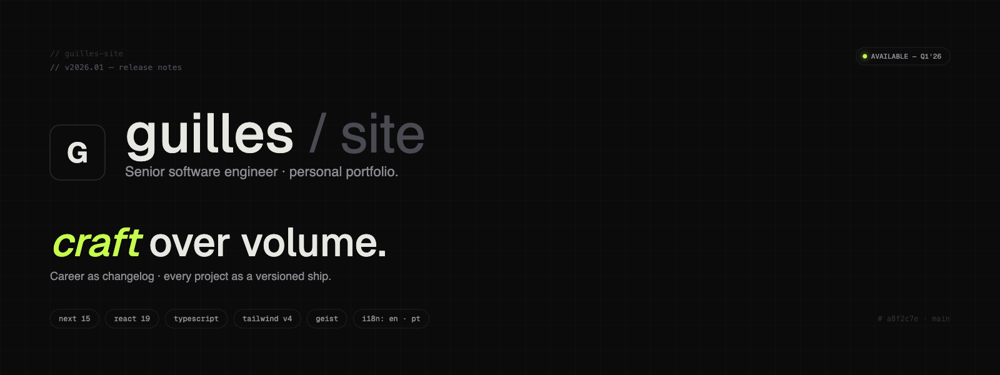
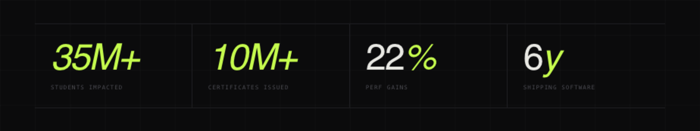
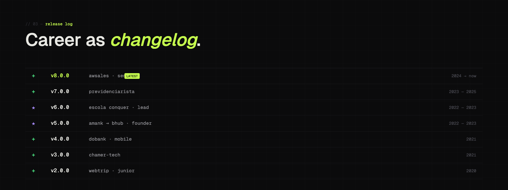
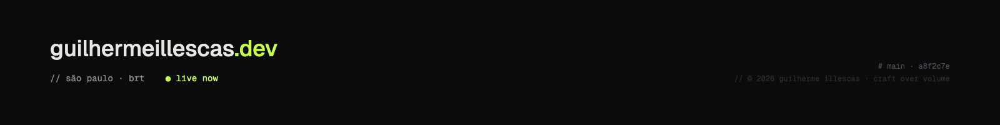

<div align="center">



<br />

# Guilles Site

**Personal portfolio of [Guilherme Illescas](https://guilhermeillescas.dev) — senior software engineer.**
Career as changelog. Every project as a versioned ship.

[](https://guilhermeillescas.dev)
[](https://nextjs.org)
[](https://react.dev)
[](https://www.typescriptlang.org)
[](https://guilhermeillescas.dev)

[ **Live** ](https://guilhermeillescas.dev) · [ **Design System** ](https://guilhermeillescas.dev/design-system)

</div>

---

## ◇ overview

This is the source of [**guilhermeillescas.dev**](https://guilhermeillescas.dev) — a personal site built like a release log. The career is the changelog, every job is a semver bump, and every project is a versioned ship.

Built end-to-end on **Next.js 15 App Router + React 19 + TypeScript**, statically pre-rendered, server-rendered metadata, JSON-LD structured data, full a11y pass, security headers, EN/PT i18n. The visual language, voice and motion grammar are documented as a public design system at [`/design-system`](https://guilhermeillescas.dev/design-system).



> Numbers above are real, not vanity. Receipts on the live site.

## ◇ why this exists

Most engineer portfolios fall into two buckets: blank Notion pages, or Webflow templates with stock illustrations. This site is neither.

- **Show, don't say.** Career rendered as a `git log`. Skills are visible in the craft, not listed in a pill cloud.
- **Type as protagonist.** Geist + Geist Mono. Headlines up to 168px, weight 500, italics on key words for rhythm.
- **One living color.** Lime `#c5fc4d`. Everything else earns contrast through scale and tracking, not hue.
- **Motion serves a purpose.** Reactive grid, magnetic buttons, word-by-word reveals — every animation orients, gives feedback, or rewards exploration. All neutralized under `prefers-reduced-motion`.
- **Bilingual first.** EN by default, PT as native — a single switch pill, persistence in a cookie, headline re-animates on toggle.

---



`★` led / founded&nbsp;&nbsp;·&nbsp;&nbsp;`+` shipped — full diffs, stacks and dates on the live site.

---

## ◇ tech

| Layer        | Choice                                                              |
| :----------- | :------------------------------------------------------------------ |
| **Framework**| Next.js 15.5 · App Router · `typedRoutes`                           |
| **UI**       | React 19 · TypeScript 5 (`strict`)                                  |
| **Styling**  | Tailwind v4 · CSS custom properties (single source of truth)        |
| **Fonts**    | Geist · Geist Mono via `next/font` (zero CLS, self-hosted)          |
| **i18n**     | React Context + cookie · SSR-safe bootstrap script · EN + PT-BR     |
| **Motion**   | `IntersectionObserver` reveals · magnetic CTAs · canvas grid        |
| **SEO**      | Full Metadata API · JSON-LD `@graph` · Edge-rendered OG image       |
| **Pkg mgr**  | pnpm                                                                |
| **Deploy**   | Vercel                                                              |

## ◇ structure

```
guilles-site/
├── app/                    Routes, metadata, OG/icons, sitemap, robots, manifest
│   ├── layout.tsx          Root — full Metadata API + JSON-LD graph
│   ├── page.tsx            Composes the home from sections
│   ├── opengraph-image.tsx Edge-rendered 1200×630 OG/Twitter card
│   ├── icon.tsx            Edge-rendered favicon
│   ├── apple-icon.tsx      Edge-rendered iOS/Android icon
│   ├── sitemap.ts          Sitemap with hreflang alternates
│   ├── robots.ts           robots.txt
│   ├── manifest.ts         PWA manifest
│   ├── globals.css         Tokens + reset + components + reduced-motion
│   └── design-system/      Public design system showcase
│
├── components/
│   ├── chrome/             Site chrome — Nav, BgCanvas, Preloader,
│   │                       LiveClock, LangSwitch, SkipLink
│   ├── motion/             Animation primitives — RevealOnScroll,
│   │                       CountUp, MagneticButton, SplitWords
│   └── sections/           Server-/client-rendered home sections
│
├── lib/
│   ├── data/               Typed content — releases (career), projects
│   ├── i18n/               Cookie-based provider · en.ts · pt.ts
│   └── seo/                Site constants and JSON-LD graph
│
└── docs/images/            README assets
```

## ◇ getting started

```bash
# clone
git clone https://github.com/guiillescas/guilles-site.git
cd guilles-site

# install
pnpm install

# develop
pnpm dev            # → http://localhost:3000

# verify
pnpm typecheck      # strict TS check
pnpm build          # production build
pnpm start          # serve build
```

> Requires **Node 20+** and **pnpm 9+**. No env vars required.

### Deploy on Vercel

```bash
vercel link
vercel --prod
```

The site is fully statically pre-rendered. Cookie-based language is read client-side via a synchronous bootstrap script in `<head>` — no flash, no SSR/CSR mismatch.

---

## ◇ engineering notes

A handful of decisions worth calling out:

### Server-first composition

`app/layout.tsx` and `app/page.tsx` are server components. Interactive islands (`Nav`, `BgCanvas`, `Preloader`, `LiveClock`, every `motion/*`) are tagged `"use client"` so only the JS that needs to ship, ships.

### SEO that grounds LLMs

- **Metadata API** with `metadataBase`, OpenGraph, Twitter Card, robots, hreflang alternates, canonical, theme color.
- **JSON-LD `@graph`** with `Person`, `WebSite`, `ProfilePage` — drives Google Knowledge Panel and grounds LLM crawlers (ChatGPT, Perplexity, Gemini).
- **Edge-rendered OG image** (`/opengraph-image`) — 1200×630 PNG, branded.
- **Sitemap, robots, manifest** generated at build time from `lib/seo/site.ts`.
- **`<title>` template** so subpages inherit the brand suffix automatically.
- Real numbers in copy: 10M+ certificates issued at Conquer, 35M+ students reached, 22% perf gains — never adjectives.

### Accessibility

- `prefers-reduced-motion` honored in CSS *and* in every motion component (canvas hidden, preloader skipped, `IntersectionObserver` reveals turned into instant state).
- `pointer: coarse` disables magnetic buttons and the canvas grid on touch devices.
- Skip-to-content link, `aria-current` on the active nav item, `aria-label`s on icon-only buttons, semantic `<dl>` / `<ol>` for the about card and timeline, focus-visible rings.

### Security

HTTP headers configured in `next.config.ts`:

```
Content-Security-Policy
Strict-Transport-Security
X-Content-Type-Options
X-Frame-Options
Cross-Origin-Opener-Policy
Cross-Origin-Resource-Policy
Permissions-Policy
Referrer-Policy
```

### Performance

- First Load JS for `/`: **~120 kB** shared + **~7 kB** route.
- All home sections render client-side off the same dictionary, but the shell is statically pre-rendered.
- Canvas RAF pauses on `visibilitychange` and skips entirely when reduced motion or coarse pointer is detected.
- Single global `Intl.DateTimeFormat` instance for the live clock.
- `next/font` self-hosts Geist with `display: swap` and emits `<link rel="preload">` font hints.

### Design tokens

A single `:root` block in `app/globals.css` defines color, type, spacing, and motion tokens. Tailwind v4 re-exports them via `@theme inline { … }` so utility classes and bespoke CSS share one source of truth — the public `/design-system` route documents the tokens.

---

## ◇ design system

The site **is** the design system. Browse it live at [**guilhermeillescas.dev/design-system**](https://guilhermeillescas.dev/design-system).

```
◆ palette       70/20/10 — bg + neutrals + lime accent
◆ type          geist (display + body) · geist mono (metadata)
◆ language      release-notes · semver · diff lines · commit hashes
◆ motion        reactive grid · word reveal · magnetic · stat counter
```

**Three rules:**

1. Pure white `#ffffff` is forbidden. Use `--text` (`#e8e8e3`).
2. Lime never on full section backgrounds — only pills, dots, italics, one primary CTA.
3. If lime starts to show up too often, you're using it wrong.

## ◇ i18n

The site is bilingual. Toggle between `EN` and `PT` via the pill in the top-right of the nav.

- Default: **English** (international audience).
- Persistence: cookie `guilles-lang` (1 year, samesite=lax).
- All copy lives in [`lib/i18n/en.ts`](./lib/i18n/en.ts) and [`lib/i18n/pt.ts`](./lib/i18n/pt.ts) as flat key-value dictionaries.
- A bootstrap script in `<head>` reads the cookie before React hydrates and sets `<html lang>` + `dataset.lang` synchronously — no flash of untranslated content.
- Hero headline re-animates word-by-word on every language change.

## ◇ ship list

| `#`  | Project                                                           | Status              |
| :--- | :---------------------------------------------------------------- | :------------------ |
| `01` | [Gui & Gi](https://www.guilherme-e-giovana.com/)                  | live · personal     |
| `02` | [Viralify](https://www.viralify.app/)                             | live · ai           |
| `03` | [Guidefy](https://guidefy.guilhermeillescas.dev/)                 | live · v1.4.0       |
| `04` | [Coffee Delivery](https://coffee-delivery.guilhermeillescas.dev/) | live · case study   |
| `05` | [Digital Hippo](https://digital-hippo.com/)                       | live · marketplace  |

---

## ◇ contributing

This is a personal portfolio, so PRs aren't expected. **Issues are welcome** — typos, broken links, accessibility regressions, motion bugs on specific browsers. Open one with a clear repro and I'll get to it.

If you want to fork the architecture for your own portfolio:

1. Fork the repo.
2. Replace [`lib/i18n/en.ts`](./lib/i18n/en.ts), [`lib/i18n/pt.ts`](./lib/i18n/pt.ts), [`lib/data/releases.ts`](./lib/data/releases.ts) and [`lib/data/projects.ts`](./lib/data/projects.ts) with your own content.
3. Update [`lib/seo/site.ts`](./lib/seo/site.ts) with your domain, social handles and JSON-LD identity.
4. **Make it yours** — don't keep my voice or palette. The point is your own opinion, not mine.

## ◇ contact

```
email     oi@guilhermeillescas.dev
github    @guiillescas
linkedin  /in/guilherme-illescas
location  curitiba · brt
status    ● available
```

---

## ◇ license

All rights reserved. Code is published for transparency, not for reuse. **The visual identity, copy and design system are not licensed.** Build your own portfolio with your own opinion; don't ship a pixel-cloned version of mine.

---



<div align="center">
<sub>Built with care · craft over volume · © 2026 Guilherme Illescas</sub>
</div>
